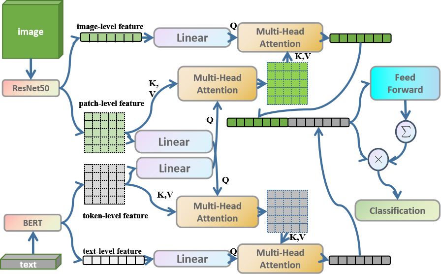
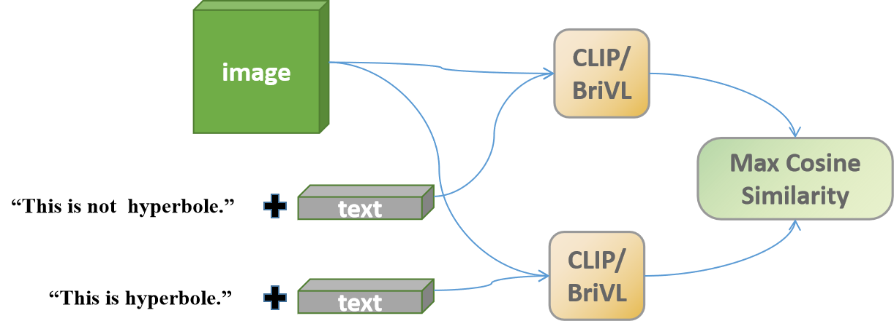

# Image Matters: A New Dataset and Empirical Study for Multimodal Hyperbole Detection
Paper Link: https://arxiv.org/abs/2307.00209


## Dataset
This is the dataset we proposed in our paper: https://drive.google.com/file/d/1SaGekDC0gK52imjbn8Jnx4DW4-oKBbj1/view?usp=sharing

### Data Structure
There are five folders in this link, each corresponding to one keyword. Under each folder there are several texts and images, with corresponding text and image having the same name.

The label of each piece of data is at the end of the text, where 1 represents hyperbole and 0 represents non-hyperbole.

## Method
Some methods are discussed in our paper.

We propose an Attn-Gate method to verify the importance of image for identifying hyperbole in multimodal data. 



We also point out that pretrained multimodal encoders (CLIP/BriVL) are not so effective on this task. The pipeline is shown as follows.



## Citations
If you find our work/dataset interesting/useful, please cite our work, thanks!

```
@article{zhang2023image,
  title={Image Matters: A New Dataset and Empirical Study for Multimodal Hyperbole Detection},
  author={Zhang, Huixuan and Wan, Xiaojun},
  journal={arXiv preprint arXiv:2307.00209},
  year={2023}
}
```
